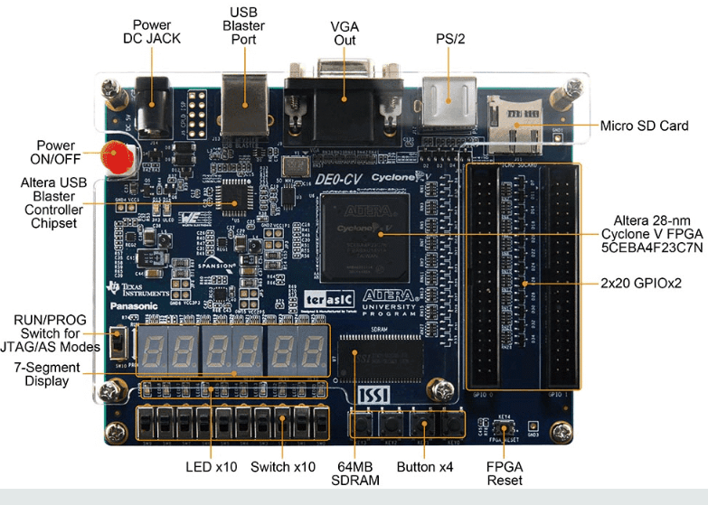
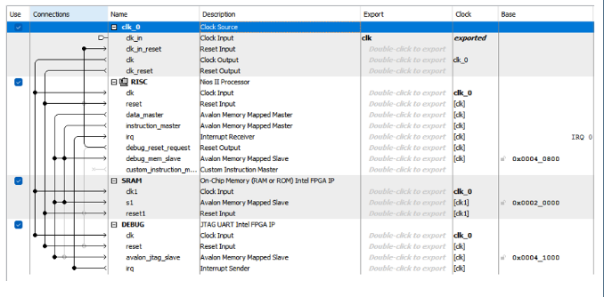

# Introduction

A softcore processor is a processor described in HDL (Hardware Description Language), which allows it to be customized according to user needs and synthesized in an FPGA or ASIC. Although it has lower performance than a hardcore processor, it offers advantages such as a higher level of abstraction, which accelerates and simplifies its development, and a specific configuration for a particular problem. FPGA manufacturers often provide their softcore processors for use in their FPGA families. In the case of Altera, we are using the NIOS II, a 32-bit RISC softcore processor.

The Altera Nios II has the following features:

 - RISC processor with pipeline
 - 32 general-purpose registers
 - 3 instruction formats
 - 32-bit instructions
 - 32-bit addressing
 - Separate, configurable-size data and instruction caches
 - On-chip memory
 - Branch prediction
 - 32 prioritizable interrupts
 - On-chip hardware (multiplications, shift, rotate, etc.)
 - Memory Management Unit (MMU)
 - Memory Protection Unit (MPU)
 - Custom hardware instructions
 - Debugging using JTAG

As FPGA board, we chosse the DE0-CV fpga board. Follow below the specifications :

# System structure

Below follow the structure of our CPU builded on quartus lite program.

# How run the project
